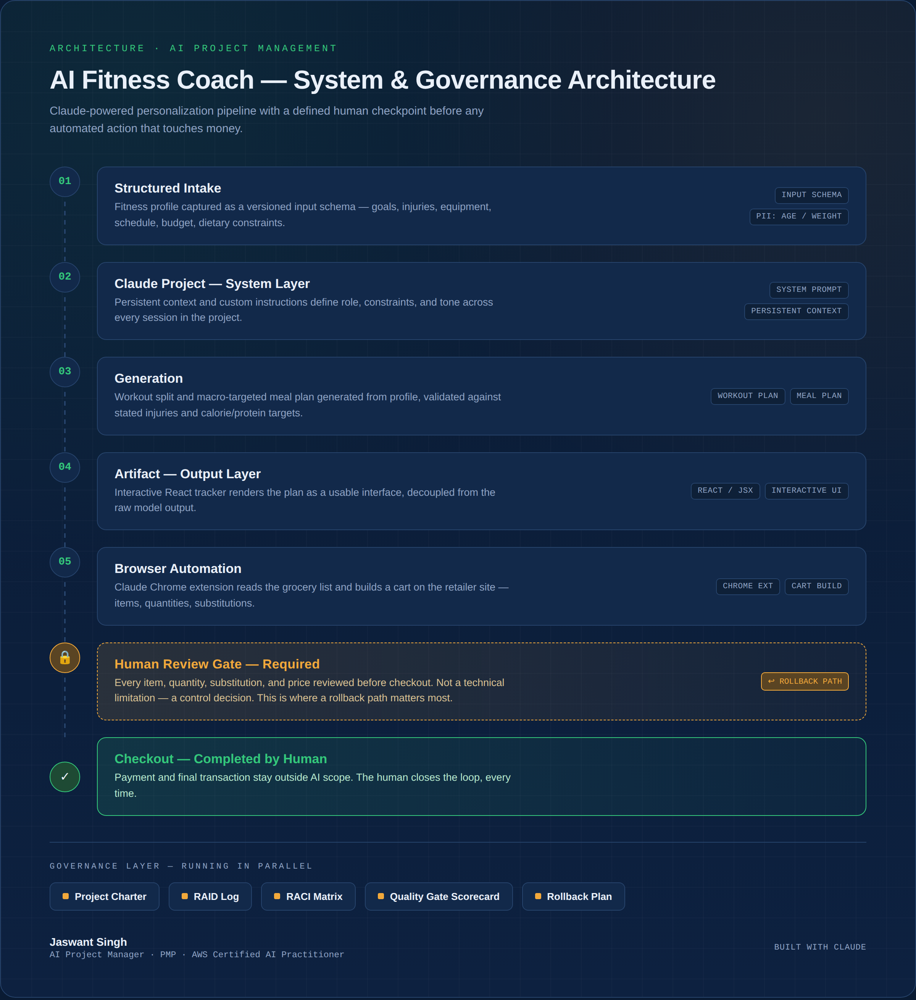

# AI Fitness Coach — Built with Claude

A personalized fitness coach system built on Claude (Projects, custom instructions, artifacts, and the Claude Chrome extension), delivered with the governance artifacts an AI Project Manager would produce before trusting an AI system with a real user and a real transaction.

This repo documents both the build and the process: what was generated, what was reviewed, and where a human checkpoint was deliberately placed before any automated action touched money.

---

## 🧭 Project Summary

| | |
|---|---|
| **Goal** | Personalized workout plan, meal plan, grocery list, and progress tracker generated from a structured fitness profile |
| **Tools** | Claude Projects, custom instructions, Claude Artifacts (React/JSX), Claude Chrome extension |
| **Timeline** | Goal-tracking window: 11 weeks (per profile input) |
| **Role** | AI Project Manager — scoped, governed, and reviewed the build end to end |
| **Status** | Personal build / portfolio project |

---

## 🏗️ Architecture

Full breakdown of each stage is in [`diagrams/architecture.html`](diagrams/architecture.html) (open in any browser — self-contained, no build step).

**Pipeline:**
1. **Structured Intake** — fitness profile as a versioned input (goals, injuries, equipment, schedule, budget, dietary constraints)
2. **Claude Project — System Layer** — persistent context + custom instructions defining role and constraints across sessions
3. **Generation** — workout split and macro-targeted meal plan
4. **Artifact — Output Layer** — interactive React tracker
5. **Browser Automation** — Claude Chrome extension builds a grocery cart from the shopping list
6. **Human Review Gate** **(required)** — every item, quantity, substitution, and price reviewed before checkout
;. **Checkout** - completed by the human, every time
